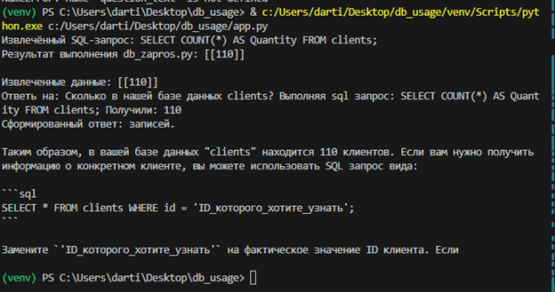

## Описание

Данный проект состоит из трех основных скриптов, которые взаимодействуют друг с другом и с базой данных для выполнения SQL-запросов и генерации ответов на основе этих запросов.

1. **process_message.py** - Основной скрипт, обрабатывающий входящие сообщения и формирующий SQL-запросы.
2. **db_zapros.py** - Скрипт, выполняющий SQL-запросы к базе данных.
3. **db_vopros.py** - Скрипт, генерирующий окончательный ответ на основе данных из базы.

## Использование

### 1. process_message.py

Функция `process_message(message)` принимает строку `message` и выполняет следующие действия:

- Проверяет наличие флага `-f` в конце сообщения для формирования SQL-запроса.
- Если флаг присутствует, отправляет запрос на API модели для формирования SQL-запроса.
- Выполняет сформированный SQL-запрос с помощью `db_zapros.py`.
- Отправляет итоговое сообщение в `db_vopros.py` для генерации ответа.

#### Пример вызова:

```python
message = "Сколько в нашей базе данных clients? -f"
final_output = process_message(message)
print(final_output)
```

### 2. db_zapros.py

Функция `execute_query(query_str)` выполняет SQL-запрос, переданный в качестве аргумента. Она подключается к базе данных и возвращает результат выполнения запроса в формате JSON.

#### Пример вызова:

```bash
python db_zapros.py "SELECT * FROM clients;"
```

### 3. db_vopros.py

Функция `send_message_to_api(message)` отправляет сообщение на API модели и получает ответ. Скрипт принимает сообщение из аргументов командной строки и отправляет его.


## Пример использования



Замените `path/to/your/image.png` на относительный или абсолютный путь к вашей картинке.

## Ошибки

- При выполнении SQL-запросов возможны ошибки, которые будут выведены в стандартный поток ошибок (`stderr`).
- В случае ошибок API будут отображены сообщения с кодом состояния.